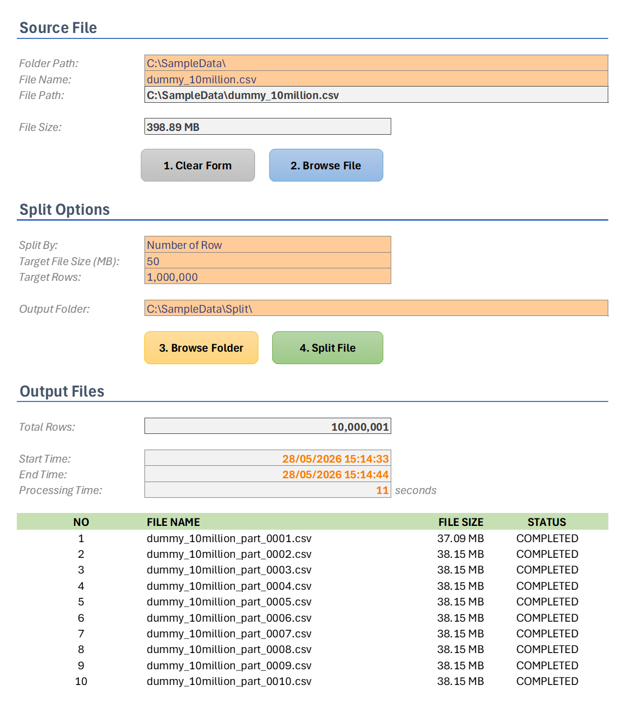

# SplitFileWithExcel

Split large CSV and text files into Excel-friendly chunks — fast, lightweight, and optimized for older computers.

## Overview

Microsoft Excel has a practical worksheet limit of approximately **1 million rows per sheet**, making it difficult to open or process large datasets directly.

**SplitFileWithExcel** is a lightweight VBA-based tool designed to split very large files into smaller, manageable parts that Excel can process. This allows the ETL (Extract-Transform-Load) pipeline achievable using Excel Automation.

Built with performance and compatibility in mind, the tool is optimized to run smoothly even on **older laptops and PCs**.

## Features

* ⚡ **Fast file splitting performance**
* 📄 **Split by number of rows**
* 📦 **Split by file size**
* 📑 **Supports CSV files**
* 📝 **Supports Text files (Tab Delimited)**
* 💻 **Optimized for old laptops and low-spec PCs**
* 🌍 **Compatible with files from Unix/Linux, Windows, and macOS**
* 📊 **Designed for Excel row limitations**

## Why Split Large Files?

Excel can only handle around **1,048,576 rows per worksheet**. Large datasets often exceed this limitation, making them impossible or difficult to open in Excel.

> You can use **Power Query** in Excel to open large dataset.

**SplitFileWithExcel** helps solve this problem by dividing a large file into smaller files that Excel can load and process without issues.

Example:

* Source file: **10 million rows**
* Output: **10 files**
* Each file: **1 million rows**

## Performance Benchmark

We tested SplitFileWithExcel using a dummy dataset containing:

* **10 million rows**
* **~388 MB file size**

### Result

✅ Split into **10 files**
✅ **1 million rows per file**
✅ Completed in approximately **11 seconds**



> Performance may vary depending on hardware, storage speed, file format, and system configuration.

## Test Laptop Specifications
* Processor	AMD Ryzen AI 7 350 w/ Radeon 860M (2.00 GHz)
* Installed RAM	32.0 GB (31.3 GB usable)
* Graphics card	AMD Radeon(TM)  860M Graphics (512 MB)
* System type	64-bit operating system, x64-based processor

## Supported File Types

SplitFileWithExcel supports:

* **CSV (.csv)**
* **Text files (.txt)** using **Tab Delimiter**

## Splitting Options

### 1. Split by Row Count

Split a large file into smaller files based on the number of rows.

Example:

* Input file: 10,000,000 rows
* Split size: 1,000,000 rows
* Result: 10 output files

### 2. Split by File Size

Split files based on a target file size for easier storage, sharing, or downstream processing.

Example:

* Input file: 5 GB
* Split size: 500 MB
* Result: Multiple smaller files

## Use Cases

* Prepare large datasets for Excel analysis
* Break down oversized CSV exports
* Split ETL or database export files
* Share large text files in manageable chunks
* Process log files and large reports

## Getting Started

1. Open the VBA-enabled Excel workbook.
2. Select a source file (`.csv` or tab-delimited text file).
	* *I attached a **dummy file with 1 million rows** in the GitHub project.*
	* *The test dummy file with 10 million rows is too big for the GitHub repository.*
3. Choose a splitting method:
   * By number of rows
   * By file size
4. Run the process.
5. Access the generated output files.

## Example

**Input**

```text
large_dataset.csv
10,000,000 rows
```

**Output**

```text
large_dataset_part_0001.csv
large_dataset_part_0002.csv
...
large_dataset_part_0010.csv
```

## Limitations

* Intended for **CSV** and **Tab Delimited Text files**
* Excel itself still has worksheet size limitations
* Processing speed depends on hardware and storage performance
